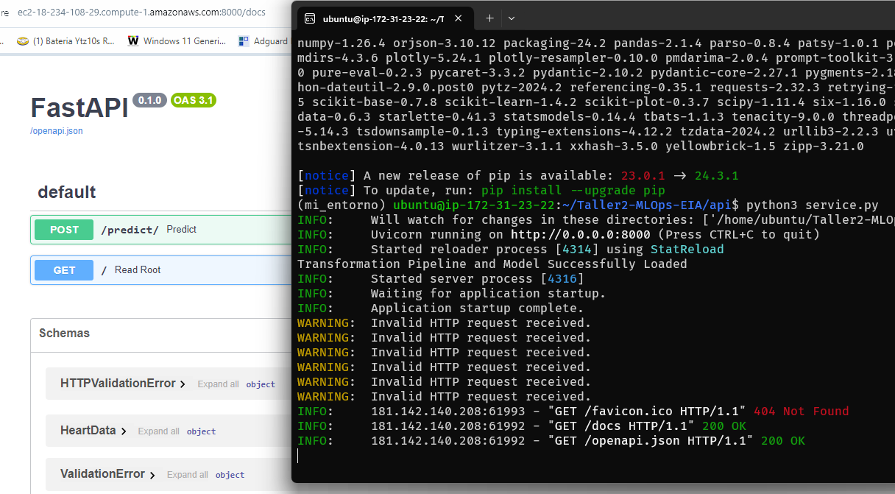
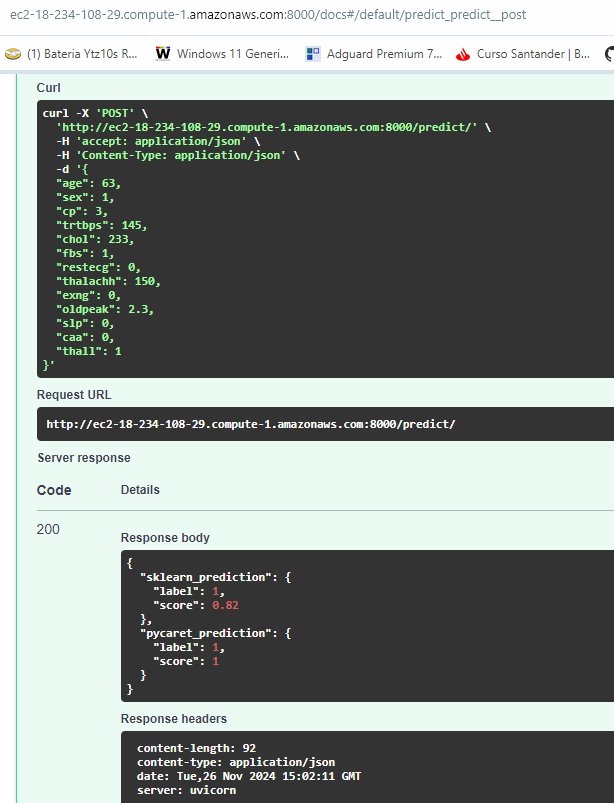

# Taller2-MLOps-EIA

Taller 2 - MLOPs - EIA

## Integrantes

* Linda Castaño
* Eldigardo Camacho

## Contenido del Taller

En este repositorio se encuentra los siguientes archivos:

* 1_CRISP-DM_Exploracion.ipynb: notebook utilizado para el analisis y exploracion de los datos
* 2_CRISP-DM_Entrenamiento.ipynb: notebook utilizado para el entrenamiento del modelo con scikit-learn y pycaret.
* heart.csv: base de datos
* Taller2_MLOps.pdf: documento con las preguntas del taller resueltas.
* mejor_modelo_pipeline.joblib: el modelo entrenado con scikit learn en formato joblib.
* mejor_modelo_pipeline.pkl: el modelo entrenado en formato pycaret.

## API

En la carpeta 'api', se encuentra el código de la aplicación FastAPI que se encarga de implementar el endpoint ```/predict```, para realizar la predición.

### Ejemplo

Para hacer la inferencia con los siguiente datos:
```
{
  "age": 63,
  "sex": 1,
  "cp": 3,
  "trtbps": 145,
  "chol": 233,
  "fbs": 1,
  "restecg": 0,
  "thalachh": 150,
  "exng": 0,
  "oldpeak": 2.3,
  "slp": 0,
  "caa": 0,
  "thall": 1
}
```
Se puede utilizar curl para hacer la prueba:

```
curl -X 'POST' \
  'http://localhost:8000/predict/' \
  -H 'accept: application/json' \
  -H 'Content-Type: application/json' \
  -d '{
  "age": 63,
  "sex": 1,
  "cp": 3,
  "trtbps": 145,
  "chol": 233,
  "fbs": 1,
  "restecg": 0,
  "thalachh": 150,
  "exng": 0,
  "oldpeak": 2.3,
  "slp": 0,
  "caa": 0,
  "thall": 1
}'
```

Se logra la respuesta:

```
{
  "sklearn_prediction": {
    "target": 1,
    "score": 0.82
  },
  "pycaret_prediction": {
    "target": 1,
    "score": 1
  }
}
```
Recordemos que el target de la base de datos tiene la siguiente descripción:

**target**: 0 = menor probabilidad de ataque cardíaco, 1 = mayor probabilidad de ataque cardíaco

Tambien se puede ingresar a Swagger UI con la URL:

[http://localhost:8000/docs](http://localhost:8000/docs)

## Despliegue EC2

Luego de ingresar por SSH a la instancia de amazon, correr los siguientes comandos:

```
git clone https://github.com/heldigard/Taller2-MLOps-EIA.git
cd Taller2-MLOps-EIA
cd api

sudo add-apt-repository ppa:deadsnakes/ppa
sudo apt update

sudo apt install python3.10
sudo apt install python3.10-venv python3-pip

# Crear y activar el entorno virtual
python3.10 -m venv mi_entorno
source mi_entorno/bin/activate

pip install -r requirements.txt
```

Para correr el servicio temporalmente:

```
python3 service.py
```

Server en EC2 corriendo:



Predicion funcionando:


